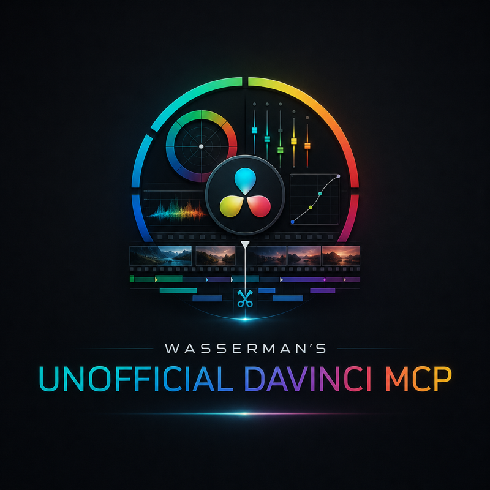
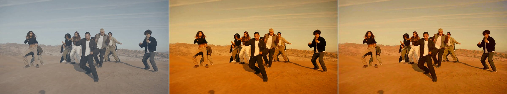
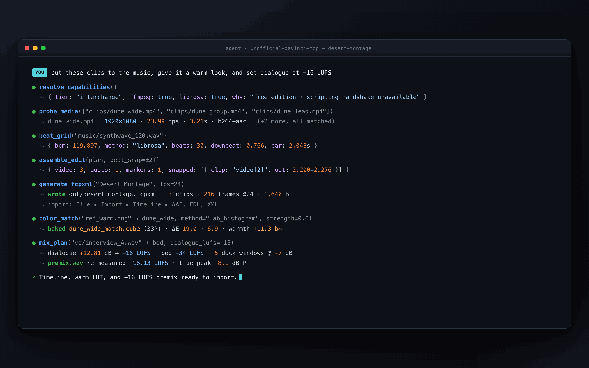
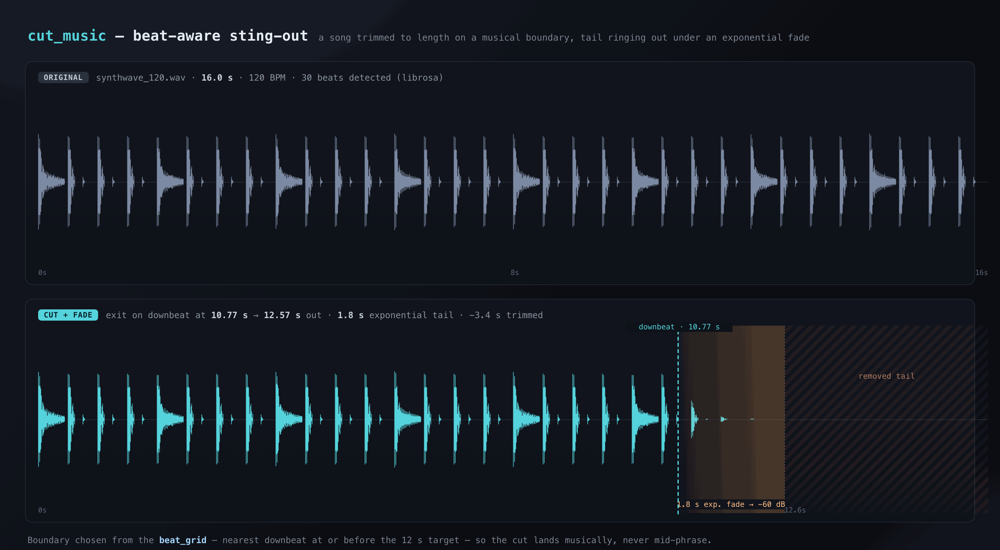
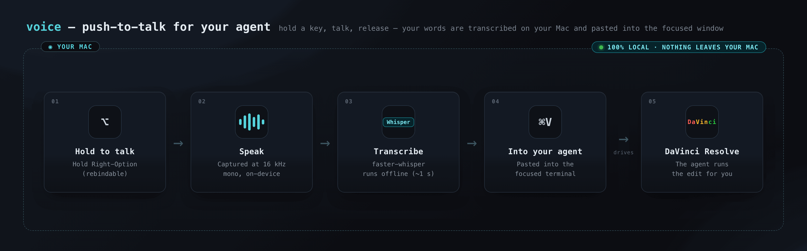

<div align="center">



# Wasserman's Unofficial DaVinci MCP

**Let any AI agent run DaVinci Resolve for you** — Claude Code, Codex, Cursor, Hermes, or any MCP client. Cut clips to the beat, match a reference look, tighten dialogue, hit a loudness spec, and build timelines — either by driving Resolve Studio live, or by generating clean import files for the free edition.

[](LICENSE)




<sub>A flat log-ish grade (BEFORE) matched to a warm reference frame (REFERENCE) → the MATCHED result, baked to a 33-point `.cube` LUT. Real output from the `color_match` engine on a single desert-dance frame.</sub>

</div>

---

You describe the edit in plain language; your agent calls the tools. The server does the deterministic, numeric work an LLM shouldn't guess at — beat grids, LUT math, EBU R128 loudness, FCPXML — and hands back files and plans you can trust. No cloud rendering, no black boxes: every engine is stdlib + numpy + ffmpeg, and every mutating tool previews before it touches anything.

## Two tiers, auto-detected

The server detects at startup whether it can drive a running **DaVinci Resolve Studio (verified on Studio 21)** or should fall back to **interchange** files. `resolve_capabilities` tells you which tier you're in and why.

| Capability | Resolve **Studio** — *live* | **Free** Resolve / not running — *interchange* |
|---|---|---|
| How it works | Drives the running app via the scripting API | Writes files you import in **one action** |
| Build & edit timelines | Directly in the app | FCPXML 1.9 / EDL → `File ▸ Import ▸ Timeline` |
| Markers | Inserted live | Marker CSV, or embedded in the FCPXML |
| Color grades & LUTs | Applied per clip via the API | Bake a `.cube` LUT and drop it on the node |
| Renders | Queue and start jobs | Use Resolve's own export |
| Probe, beat grid, music cut, dialogue tighten, loudness, mix | ✅ engines run either way | ✅ engines run either way |
| **External scripting** | ✅ **Studio only** | ❌ not available in free Resolve |

Being honest about it: **external scripting is a DaVinci Resolve Studio feature.** On the free edition the live tools can't reach the app — but every creative engine still runs, and the interchange writers give you a timeline, LUTs, markers, and a premix you import in a single step. Nothing about the free path is a stub.

## Quick start

Install straight from GitHub:

```bash
pip install "git+https://github.com/wassermanproductions/unofficial-davinci-mcp.git"
```

Optional extras — beat-tracking (`librosa`) and the push-to-talk voice bridge:

```bash
pip install "unofficial-davinci-mcp[beats] @ git+https://github.com/wassermanproductions/unofficial-davinci-mcp.git"
pip install "unofficial-davinci-mcp[voice] @ git+https://github.com/wassermanproductions/unofficial-davinci-mcp.git"
```

Or clone and install editable:

```bash
git clone https://github.com/wassermanproductions/unofficial-davinci-mcp.git
cd unofficial-davinci-mcp
pip install -e .
```

You also need **ffmpeg** on your PATH (`brew install ffmpeg`, or your distro's package). That's the only non-Python dependency.

### Wire it into your agent

**Claude Code** — one line:

```bash
claude mcp add davinci -- unofficial-davinci-mcp
```

**Any MCP client** (generic `mcpServers` JSON):

```json
{
  "mcpServers": {
    "davinci": {
      "command": "unofficial-davinci-mcp"
    }
  }
}
```

**Hermes** — `~/.hermes/config.yaml`:

```yaml
mcpServers:
  davinci:
    command: unofficial-davinci-mcp
```

If the console script isn't on your PATH, use `python -m davinci_mcp` as the command instead. Then ask your agent to call `resolve_capabilities` first — it reports your tier, Resolve version, ffmpeg, and optional dependencies.

---

## What it can do

### Reference color matching

Point `color_match` at a reference still (or a graded frame) and the shots you want to match. It samples both in CIE Lab, computes a per-shot transform (Reinhard mean/std, or a firmer Lab-histogram match), and bakes a Resolve-loadable **33-point `.cube` LUT** — plus a before/after preview strip and the numeric ΔE convergence. The hero strip above is a real run: a flat grade pulled to a warm reference, ΔE **43.9 → 3.2**. On Studio it can apply the LUT for you; on free Resolve you get the file to drop on a node.

### A worked example, end to end

> *"Cut these clips to the music, give it a warm look, and set dialogue at −16 LUFS."*



One request, seven tool calls: read the tier, probe the media, find the tempo, assemble a beat-snapped edit, write an FCPXML, bake a warm LUT, and plan the mix — every number above is real output from the running server.

### Beat-aware music cutting

`beat_grid` finds the tempo, beats, downbeat, and onset strengths (librosa when installed, an energy-envelope fallback when not). `cut_music` uses that grid to trim a track to a target length **on a musical boundary**, then rings the tail out under an exponential fade — or lands on a hit with a "button" ending. No cuts mid-phrase.



### Dialogue, loudness, and the mix

- **`tighten_dialogue`** detects dead air in a talking clip and returns a keep-range cut plan (with head/tail handles) — apply it live, or export the tightened edit as FCPXML.
- **`measure_loudness`** reports EBU R128 integrated LUFS, loudness range, and true-peak per file.
- **`mix_plan`** normalizes dialogue to your delivery spec, sets the music bed under it, derives ducking windows from speech, and renders a **re-measured** premix so you can trust the number.

### Build the timeline

`assemble_edit` validates an edit plan against your probed media and snaps cuts to a beat grid. Then `generate_fcpxml` writes an **FCPXML 1.9** timeline that imports cleanly into Resolve 19/20, `generate_edl` writes a CM3600 cut list, and `generate_marker_csv` writes a marker manifest. On Studio, `resolve_create_timeline` / `resolve_append_to_timeline` build it in the app directly.

---

## The 37 tools

Every mutating tool defaults to `dry_run=true` and returns a plan; re-run with `dry_run=false` and `confirm=true` to apply it. Tier **both** = works in free or Studio; **live** = requires DaVinci Resolve Studio.

| Tool | Tier | What it does |
|---|---|---|
| `resolve_capabilities` | both | Report the active tier, Resolve version, ffmpeg, and optional deps. **Call first.** |
| `get_editing_knowledge` | both | Serve editorial knowledge (color, beat, dialogue, music, mixing) with concrete numbers. |
| `probe_media` | both | ffprobe files: duration, fps, resolution, codecs, audio channels/rate, timecode. |
| `scan_media_folder` | both | Scan a folder and probe every media file, in stable sorted order. |
| `beat_grid` | both | Estimate tempo (BPM), beat times, a downbeat guess, and onset strengths. |
| `cut_music` | both | Cut a song to length on a musical boundary with a smooth sting-out. |
| `color_match` | both | Match clips/stills to a reference; bake a 33-point `.cube` LUT with a preview. |
| `measure_loudness` | both | Measure EBU R128 integrated LUFS, loudness range, and true-peak per file. |
| `mix_plan` | both | Plan dialogue-normalize + music bed + ducking; render a re-measured premix. |
| `tighten_dialogue` | both | Detect dead air in a talking clip; return a keep-range cut plan. |
| `assemble_edit` | both | Validate an edit plan against probed media; snap cuts to a beat grid. |
| `generate_fcpxml` | both | Write an FCPXML 1.9 timeline that imports cleanly into Resolve. |
| `generate_edl` | both | Write a CM3600 EDL cut list for round-tripping. |
| `generate_marker_csv` | both | Write a marker manifest CSV (frame, timecode, name, color, note). |
| `resolve_project_summary` | live | Read the current project, timelines, active-timeline fps and markers. |
| `resolve_render_status` | live | Check render progress and the render queue. |
| `resolve_import_media` | live | Import media into the project media pool. |
| `resolve_create_timeline` | live | Create a timeline seeded from a clip plan, music, and markers. |
| `resolve_append_to_timeline` | live | Append clips (with source/record ranges) to the active timeline. |
| `resolve_add_markers` | live | Add markers to the active timeline. |
| `resolve_apply_lut` | live | Apply a `.cube` LUT to clips on a timeline video track. |
| `resolve_set_grade` | live | Set ASC CDL slope/offset/power/saturation on clips. |
| `resolve_render` | live | Configure and start a render job for the current timeline. |

---

## It knows editing, not just buttons

Operating the app is half the job; knowing what a good edit *is* is the other half. `get_editing_knowledge` serves the same editorial playbook the tools were built around — written like a seasoned editor briefing an assistant, with numbers your agent can act on:

- **Loudness by destination.** Dialogue sits at **−16 LUFS** for web / **−23 LUFS** for broadcast; the music bed rides **4–8 dB under** it; ducking is **−6 to −8 dB** with a **0.3 s attack / 0.5 s release**; the master limiter caps at **−1 dBTP**. `mix_plan` takes these as parameters.
- **Cut to the energy, not the metronome.** At 120 BPM a beat is **12 frames** — so cut a *moving* shot **1–2 frames early** and the motion lands on the beat perceptually; hold **8–16 shots per 8 bars** in the chorus and only **1–3** in the intro. `assemble_edit`'s beat-snap tolerance tightens to **±2 frames** for the drop.
- **Match, don't invent.** For teal-and-orange, reference a warm-skin/cool-shadow frame with `method="lab_histogram"` at **strength 0.5–0.65**, and *always* re-check skin last. Never bake exposure or white balance into a look LUT.

Topics: `color-looks`, `beat-cutting`, `dialogue-editing`, `music-editing`, `mixing`.

---

## One-command workflows

Four headline tools chain the engines above into a single call. Each one plans first (`dry_run=true`) and returns a plan you can inspect before it writes anything.

### Auto-edit to music

Scan a footage folder, beat-grid the song, cut it to length, and lay a beat-synced edit whose cut density tracks the song's energy — long holds in the intro, 1–2 beat cuts in the chorus — with a no-adjacent-same-source variety rule. Every cut carries a rationale, and the plan exports as FCPXML or feeds `resolve_create_timeline` live.

```text
auto_edit(music="track.wav", media_dir="./footage", target_seconds=30, style="music_video")
```

### Search footage by what's said

Transcribe every clip once (cached), then search the spoken words by phrase, all-words, or regex. Hits come back with timestamps and context; `build_selects=true` cuts them into a selects timeline with 0.5 s handles.

```text
find_in_footage(query="let's go", media="./interviews", mode="phrase", build_selects=true)
```

### Captions and chapters

Turn a transcript into broadcast-sane SRT/VTT captions (line-length, duration, and orphan-word rules, speech-snapped timing, optional karaoke), and derive YouTube chapters from the speech's own topic shifts.

```text
generate_captions(media="talk.mp4", format="srt")   #  youtube_chapters(media="talk.mp4")
```

### Grade a timeline to a reference

Match every clip to a reference frame with one auto-tuned LUT each: the loop reads the quality report and lowers strength (down to a 0.5 floor) until the grade passes its gates, flagging any clip it can't as `needs_human`. Returns per-clip LUTs plus a live/interchange apply manifest.

```text
grade_timeline(reference_image="look.png", clips=[{"path": "a.mov", "in": 0, "out": 4}])
```

---

## Talk to your editor

An optional macOS **push-to-talk voice bridge** lets you hold a key, speak, and drop the transcript straight into your agent terminal — hands on the footage, not the keyboard.



It runs **entirely on your Mac**: `faster-whisper` transcribes locally, nothing is sent to the cloud, and editing jargon (LUFS, J-cut, sting, FCPXML) is biased into the model so it transcribes cleanly. Setup, permissions, and configuration are in **[voice/README.md](voice/README.md)**.

```bash
pip install "unofficial-davinci-mcp[voice] @ git+https://github.com/wassermanproductions/unofficial-davinci-mcp.git"
python -m voice
```

---

## Requirements & troubleshooting

- **Python ≥ 3.10**, **numpy**, and **ffmpeg** on your PATH (checked in `/opt/homebrew/bin`, `/usr/local/bin`, `/usr/bin` as fallbacks). Install ffmpeg with `brew install ffmpeg` on macOS or your distro's package manager on Linux.
- **`librosa`** is an optional extra (`[beats]`) for tempo-tracked beat grids; without it, `beat_grid` uses an energy-envelope fallback that still works.
- **Studio vs free.** Live tools need DaVinci Resolve **Studio**, running, with external scripting enabled (**Preferences ▸ System ▸ General ▸ External scripting using: Local**). If you're on the free edition or Resolve isn't running, the server drops to interchange automatically — `resolve_capabilities` explains why.
- **"Studio required" / handshake failed.** The scripting module loaded but couldn't reach the app: confirm Resolve is open, you're on Studio, and scripting is enabled. Everything in the interchange tier still works regardless.
- **The voice bridge needs Microphone + Accessibility permissions** — see [voice/README.md](voice/README.md) for the walkthrough.

---

## Disclaimer

**Unofficial.** This project is not affiliated with, authorized by, or endorsed by Blackmagic Design. "DaVinci Resolve" is a trademark of Blackmagic Design Pty Ltd. This is an independent, community tool that talks to Resolve through its public scripting API and standard interchange formats.

---

## Support

A few people asked if they could send tips to support my work developing open source tools. So I set up an optional way in case anyone wants to.

No pressure at all. Using the apps, sharing them, starring the repositories, and contributing code all help too. Thank you.

- [GitHub Sponsors](https://github.com/sponsors/wassermanproductions)
- [Ko-fi](https://ko-fi.com/samwasserman)

## License & credits

**Apache License 2.0** — see [LICENSE](LICENSE). Free to use, modify, fork, and build on, commercially or otherwise.

**Attribution required:** per the [NOTICE](NOTICE) file (Apache 2.0 §4(d)), any use, fork, or redistribution must retain the NOTICE file and credit **Sam Wasserman ([wassermanproductions.com](https://wassermanproductions.com))** in its documentation and about/credits surface.

Created by **Sam Wasserman** — [wassermanproductions.com](https://wassermanproductions.com) · [wasserman.ai](https://wasserman.ai).
